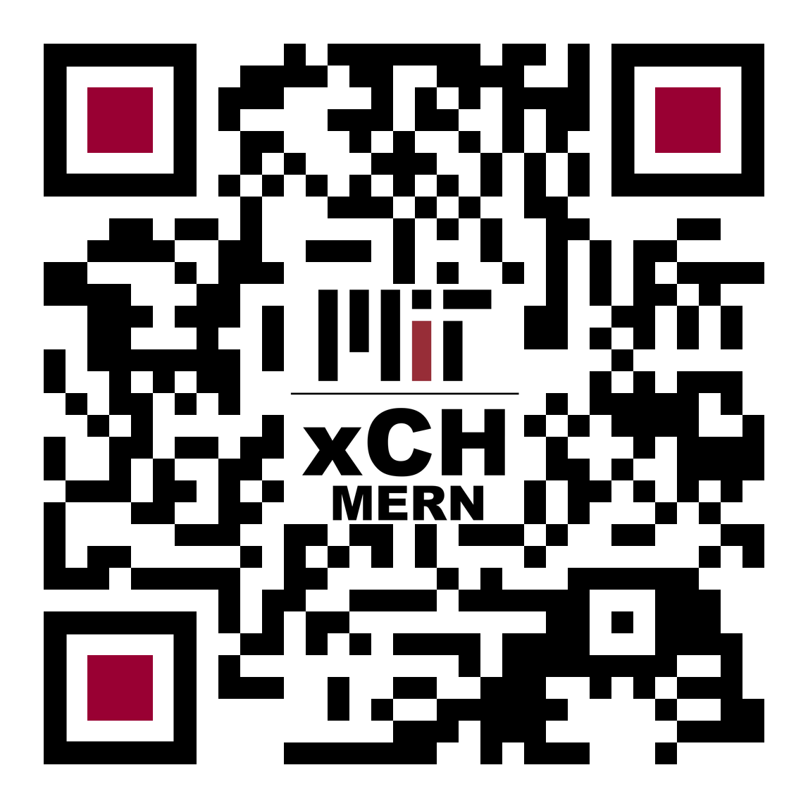
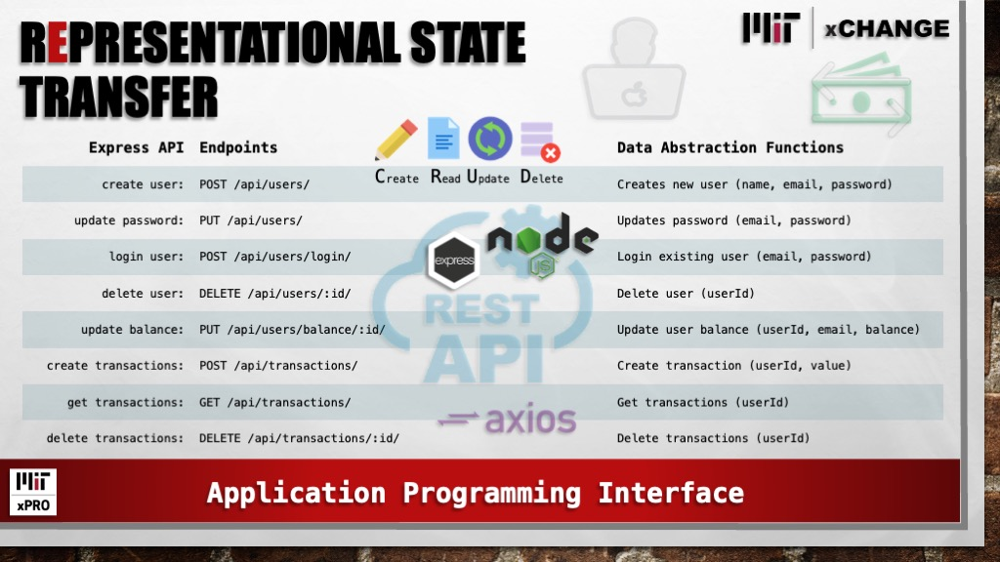
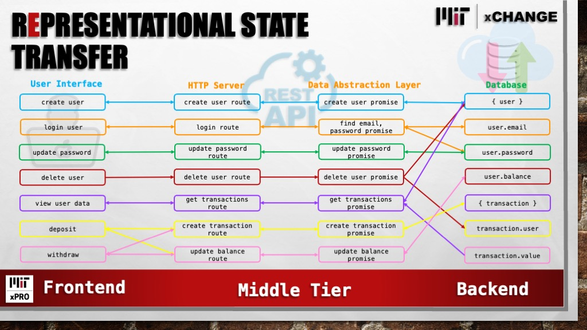

#  **MIT xCHANGE** | Full Stack MERN Bank

 ***Demo:*** Heroku Deployment [https://xch-mern.herokuapp.com/](https://xch-mern.herokuapp.com/)
 
 >***Videos***

 *Application Overview:* [https://youtu.be/yvSPJEmRH1w](https://youtu.be/yvSPJEmRH1w)

 *Database and API:* [https://youtu.be/-0C40KMb4Nc](https://youtu.be/-0C40KMb4Nc)

 *Troubleshooting and Hosting:* [https://youtu.be/sS5UZLYyZs4](https://youtu.be/sS5UZLYyZs4)

 

 > Skills Utilized:
 <ol>
    <li>HTML, CSS, JavaScript</li>
    <li>MongoDB, Mongoose, Express, React, Redux, Node</li>
    <li>Axios, Bootstrap, React Router, ScrollMagic, Toastify, React Icons</li>
    <li>API Fetch and Dynamic Component Rendering</li>
    <li>Input Validation and Error Handling</li>
    <li>Mobile First and Responsive Design</li>
 </ol>

  

## About

MIT xCHANGE Full Stack MERN Bank was developed during coding bootcamp week 15. This was 'break week' between our front-end [BadBank](https://codetracklift.github.io/xchange/) project and the final trimester of the bootcamp where we cover back-end development.

I wanted to get some more exposure to MongoDB and Express.js, so I decided to 'upgrade' my front-end BadBank project to be a Full Stack MERN Bank that uses JSON Web Tokens for authentication.  I used the [GoalSetter](https://goalsbypete.herokuapp.com/) app as a starting point for the database and  back-end routes.

The next challenge was to integrate the front-end and back-end into a single application.  For full CRUD functionality, I  developed back-end routes and front-end components to update passwords and delete users.  Please try out the demo and let me know what you think.  Please note, it is deployed on Heroku and may take a minute to spin up.

## Related Projects

> Front-End BadBank

Demo: [https://codetracklift.github.io/xchange/](https://codetracklift.github.io/xchange/)

Readme: [https://github.com/codeTrackLift/xchange#readme](https://github.com/codeTrackLift/xchange#readme)

> GoalSetter

Demo: [https://goalsbypete.herokuapp.com/](https://goalsbypete.herokuapp.com/)

Readme: [https://github.com/codeTrackLift/goals#readme](https://github.com/codeTrackLift/goals#readme)

## How to Run

> Heroku Deployment

This app is deployed on Heroku and may take a minute to start up.

> Account Management & User Data

Users can create a new account or log into an existing account on the Account page. User data is stored in a MongoDB Atlas database and can be deleted on the User Data page.

> Deposits and Withdrawals

Once logged in, users can make transactions on the respective pages. The app will validate the user's input and notify the user of any errors.

> Currency Calculator & Exchange Rates

API data is fetched from CoinGecko.com upon page load. The app will display the current exchange rates for today's date. The user can use the currency calculator to convert between currencies.

> Dependencies

React, Axios, Bootstrap, Formik, React Router, ScrollMagic, Toastify, React Icons

## API Routes

 
 

## Future Roadmap

- [x] Develop back-end using MongoDB and Express.js
- [x] Integrate BadBank with back-end
- [x] Deploy and test on Heroku
- [x] Develop 'forgot password' route
- [x] Develop 'delete user' route
- [x] Add toastify notifications

## MIT License

Copyright (c) 2022 Pete Chu  ***[codeByPete](https://www.codebypete.com/)***

Permission is hereby granted, free of charge, to any person obtaining a copy of this software and associated documentation files (the "Software"), to deal in the Software without restriction, including without limitation the rights to use, copy, modify, merge, publish, distribute, sublicense, and/or sell copies of the Software, and to permit persons to whom the Software is furnished to do so, subject to the following conditions:

The above copyright notice and this permission notice shall be included in all copies or substantial portions of the Software.

THE SOFTWARE IS PROVIDED "AS IS", WITHOUT WARRANTY OF ANY KIND, EXPRESS OR IMPLIED, INCLUDING BUT NOT LIMITED TO THE WARRANTIES OF MERCHANTABILITY FITNESS FOR A PARTICULAR PURPOSE AND NONINFRINGEMENT. IN NO EVENT SHALL THE AUTHORS OR COPYRIGHT HOLDERS BE LIABLE FOR ANY CLAIM, DAMAGES OR OTHER LIABILITY, WHETHER IN AN ACTION OF CONTRACT, TORT OR OTHERWISE, ARISING FROM, OUT OF OR IN CONNECTION WITH THE SOFTWARE OR THE USE OR OTHER DEALINGS IN THE SOFTWARE.